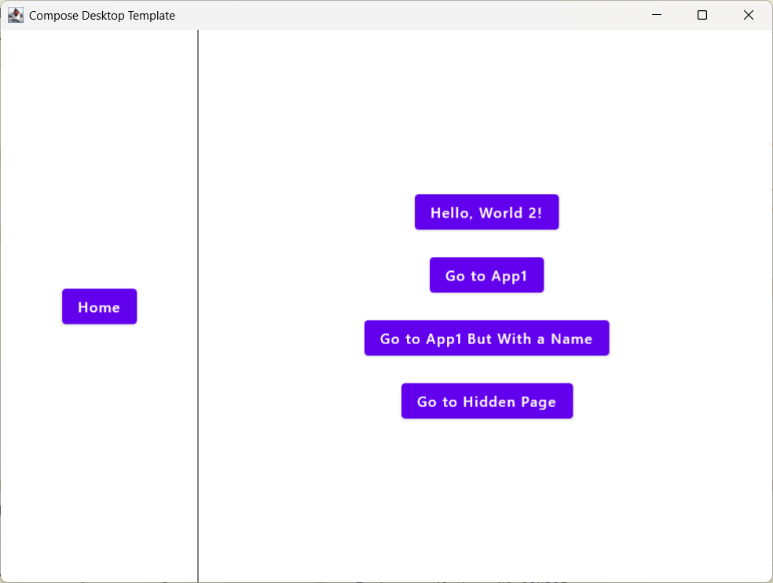

= MusicPlayer - Advanced Desktop Music Player
:toc: left
:toclevels: 3
:icons: font
:source-highlighter: highlightjs

A comprehensive desktop music player built with Jetbrains Compose for Desktop, featuring modern audio playback, playlist management, and music downloading capabilities.

== Overview

This application is a full-featured music player that provides:

* **Multi-format Audio Support**: MP3, WAV, FLAC, AU, AIFF, OGG, Opus, M4A, AAC, WMA
* **Advanced Playback Features**: Volume control, shuffle, repeat modes (off/all/one)
* **Comprehensive Playlist System**: Create, edit, manage multiple playlists
* **Music Discovery**: YouTube search and download integration
* **Enhanced Metadata**: Complete track information extraction with fallbacks
* **Modern UI**: Clean, responsive interface with intuitive controls

== Features

=== Audio Playback
* Support for 10+ audio formats including modern Opus and M4A
* Volume control with real-time adjustment
* Shuffle and repeat modes (off, all tracks, single track)
* Automatic track progression with smart repeat handling
* Enhanced metadata extraction with multiple fallback sources

=== Playlist Management
* Create unlimited custom playlists
* Add/remove tracks from playlists
* Reorder tracks within playlists
* Rename, duplicate, and clear playlists
* Protected default playlists ("All Music", "Favorites")
* Real-time playlist statistics

=== Music Discovery & Download
* YouTube search integration
* Parse and extract track information from search results
* Download framework (extensible for yt-dlp integration)
* Automatic integration with music library
* Direct URL download support

=== User Interface
* Clean, modern Material Design interface
* Responsive layout with sidebar playlist navigation
* Enhanced player controls with progress indication
* Search and download interface
* Real-time status updates and notifications

== Libraries

=== Core Libraries

[cols="1,1,2", options="header"]
|===
|Library |Version |Purpose
|Compose for Desktop |1.8.2 |UI toolkit for building desktop applications with Kotlin
|Kotlin JVM |2.2.10 |Kotlin programming language for JVM
|Kotlinx Coroutines |1.8.1 |Asynchronous programming support
|===

=== Audio Libraries

[cols="1,1,2", options="header"]
|===
|Library |Version |Purpose
|BasicPlayer |3.0.0.0 |Core audio playback engine
|MP3SPI |1.9.5.4 |MP3 format support
|VorbisSPI |1.0.3.3 |OGG Vorbis format support
|JAudioTagger |2.0.3 |Audio metadata extraction
|ISOParser |1.9.56 |M4A/MP4 metadata parsing
|===

=== Network & Serialization

[cols="1,1,2", options="header"]
|===
|Library |Version |Purpose
|Ktor Client |2.3.12 |HTTP client for downloads and API calls
|Kotlinx Serialization |1.6.3 |JSON serialization for playlists
|JSoup |1.17.2 |HTML parsing for YouTube search
|JSON |20240303 |JSON parsing utilities
|===

=== Navigation and Routing

[cols="1,1,2", options="header"]
|===
|Library |Version |Purpose
|PreCompose |1.6.2 |Navigation library for Compose applications
|Malefic Nav |1.3.3 |Custom navigation components and utilities
|===

=== UI Components and Theming

[cols="1,1,2", options="header"]
|===
|Library |Version |Purpose
|Malefic Components |1.1.0 |Custom UI components for Compose
|Malefic Theming |1.1.2 |Theming support with JSON configuration
|Malefic Engine |1.3.0 |UI building engine with DSL-like syntax
|===

=== Extensions

[cols="1,1,2", options="header"]
|===
|Library |Version |Purpose
|Malefic Extensions Core |1.4.2 |Core utility extensions for Kotlin
|Malefic Extensions Compose |1.4.2 |Compose-specific utility extensions
|===

=== Development Tools

[cols="1,1,2", options="header"]
|===
|Library |Version |Purpose
|Kotlinter |5.0.2 |Kotlin linting and formatting tool
|===

== Installation & Usage

=== Prerequisites

* JDK 17 or higher
* Gradle 9.0 or higher
* At least 512MB RAM
* Sound system support (ALSA, PulseAudio, etc.)

=== Running the Application

1. Clone the repository
+
[source,bash]
----
git clone https://github.com/OmyDaGreat/MusicPlayer.git
cd MusicPlayer
----

2. Make gradlew executable (Linux/macOS)
+
[source,bash]
----
chmod +x gradlew
----

3. Run the application
+
[source,bash]
----
./gradlew runDistributable
----

=== Building Distribution Packages

To build platform-specific distribution packages:

[source,bash]
----
./gradlew packageDistributionForCurrentOS
----

This creates packages in `build/compose/binaries/main/`:
* **Windows**: MSI installer
* **macOS**: DMG disk image  
* **Linux**: DEB package

== User Guide

=== Getting Started

1. **First Launch**: The application creates a `~/Music` directory and initializes default playlists
2. **Add Music**: Place audio files in `~/Music` or use the search & download feature
3. **Scan Library**: Click the refresh button to scan for new music files
4. **Create Playlists**: Use the + button in the sidebar to create custom playlists

=== Playing Music

* **Select Playlist**: Click on any playlist in the sidebar
* **Play Track**: Double-click any track in the main view
* **Control Playback**: Use the bottom player controls
* **Adjust Volume**: Use the volume slider in the player controls
* **Shuffle/Repeat**: Toggle shuffle and repeat modes with the respective buttons

=== Playlist Management

* **Create**: Click + button in sidebar, enter playlist name
* **Rename**: Right-click playlist → Rename (for custom playlists)
* **Add Tracks**: Drag tracks from "All Music" to custom playlists
* **Remove Tracks**: Right-click track in playlist → Remove
* **Reorder**: Drag tracks to reorder within playlists

=== Search & Download

1. Click the download icon in the sidebar to open search interface
2. Enter search terms (e.g., "Artist - Song Title")
3. Browse search results from YouTube
4. Click download button next to desired tracks
5. Downloaded tracks automatically appear in "All Music" playlist

*Note*: Current implementation provides search framework. For full YouTube download functionality, integrate with yt-dlp.

=== Supported Audio Formats

The application supports these audio formats:
* **Lossless**: FLAC, WAV, AU, AIFF
* **Compressed**: MP3, OGG Vorbis, Opus, M4A, AAC, WMA

== Configuration

=== Music Directory

By default, music is stored in `~/Music`. The application creates:
* `~/Music/` - Main music library
* `~/Music/Downloads/` - Downloaded tracks
* `~/Music/playlists.json` - Playlist configuration

=== Default Playlists

* **All Music**: Contains all scanned tracks (read-only)
* **Favorites**: For your favorite tracks
* **Custom Playlists**: User-created playlists

== Development

=== Project Structure

[source]
----
MusicPlayer/
├── build.gradle.kts           # Build configuration
├── src/main/kotlin/xyz/malefic/compose/
│   ├── Main.kt               # Application entry point
│   ├── screens/              # UI screens
│   │   └── SearchDownloadScreen.kt
│   └── util/                 # Core utilities
│       ├── MusicManager.kt   # Music library management
│       ├── MusicPlayerService.kt # Audio playback service
│       ├── DownloadManager.kt # Download & search functionality
│       └── Data.kt           # Data models
└── README.adoc               # This file
----

=== Building from Source

1. **Setup Development Environment**
+
[source,bash]
----
git clone https://github.com/OmyDaGreat/MusicPlayer.git
cd MusicPlayer
./gradlew build
----

2. **Code Style**
+
[source,bash]
----
./gradlew formatKotlin    # Format code
./gradlew lintKotlin      # Check code style
----

3. **Testing**
+
[source,bash]
----
./gradlew test           # Run tests
----

== Advanced Features

=== Extending Download Functionality

The current download system provides a framework for integration with external tools:

[source,kotlin]
----
// Example: Integrate with yt-dlp for full YouTube download support
class YTDLPDownloadManager : DownloadManager() {
    suspend fun downloadWithYTDLP(videoId: String): Track {
        // Implementation using yt-dlp process
        // Download audio, extract metadata, create Track object
    }
}
----

=== Custom Audio Format Support

To add support for additional audio formats:

1. Add the extension to `audioExtensions` in `MusicManager.kt`
2. Ensure the audio library supports the format
3. Update metadata extraction if needed

=== Plugin Architecture

The modular design allows for easy extension:
* `MusicPlayerService` - Swap audio backends
* `DownloadManager` - Add new download sources
* `MusicManager` - Customize library management
* UI screens - Add new functionality panels

== Troubleshooting

=== Common Issues

**Application won't start**
- Ensure JDK 17+ is installed
- Check that audio system is working
- Verify permissions to ~/Music directory

**Audio playback issues**
- Check supported format (see supported formats list)
- Verify file isn't corrupted
- Ensure audio drivers are working

**Search not working**
- Check internet connection
- YouTube search uses web scraping (may break with site changes)
- Consider implementing yt-dlp integration for reliability

**Missing metadata**
- Some formats may have limited metadata support
- Files downloaded from internet may lack proper tags
- Use music management software to add metadata

=== Performance Tips

* Keep music library under 10,000 tracks for optimal performance
* Use FLAC for archival, MP3/OGG for daily listening
* Regular cleanup of download folder
* Close other audio applications to avoid conflicts

== Contributing

Contributions are welcome! Please:

1. Fork the repository
2. Create a feature branch
3. Follow the existing code style (use `./gradlew formatKotlin`)
4. Add tests for new functionality
5. Submit a pull request

=== Development Guidelines

* Use Kotlin coroutines for async operations
* Follow Material Design principles for UI
* Maintain compatibility with existing playlists
* Document new features in README
* Add error handling for user-facing features

== License

This project is licensed under the MIT License. See the link:LICENSE[LICENSE] file for more details.

== Acknowledgments

* Jetbrains Compose for Desktop framework
* BasicPlayer and associated audio libraries
* JAudioTagger for metadata extraction
* Ktor for HTTP client functionality
* All contributors and testers
